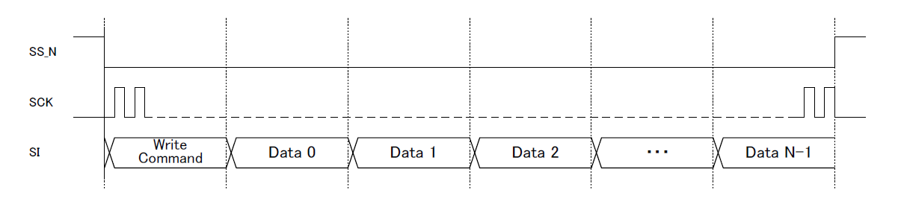
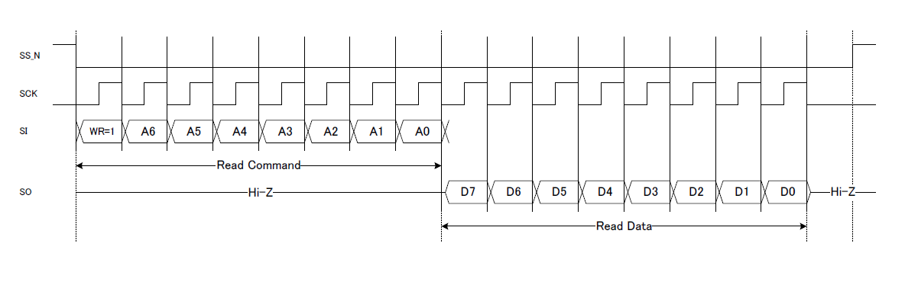

# YMF825(SD-1) IF specification

## Caution

Although this manual is created based on the SD-1 specifications, only the information necessary for YMF825Board is described. Therefore, please understand beforehand that it is not a complete specification of SD-1.
In addition, please understand that we will not guarantee any results by using SD-1 based on the contents posted in this manual.

## Features

+ 16-voice polyphonic FM synthesizer
+ 29 on-chip operator-waveforms and 8 algorithms offers a whole variety of sound
+ Synchronous serial data link for host controller interface
+ Integrated loudspeaker driver (Also supports external amplifier connection)
+ Integrated 3-band equalizer
+ Integrated 16-bit monaural DAC

## Interface Register

### System Setting

+ I_ADR#0-2, 4, 29 can be accessed even when the ALRST is "1".
As might be expected, other registers can be accessed only when the ALRST is "0".

| I_ADR | Name | W/R | D7 | D6 | D5 | D4 | D3 | D2 | D1 | D0 | Reset Value |
|-|-|-|-|-|-|-|-|-|-|-|-|
|#0| Clock Enable |W/R|"0"|"0"|"0"|"0"|"0"|"0"|"0"|CLKE|00H |
|#1|Reset|W/R|ALRST|"0"|"0"|"0"|"0"|"0"|"0"|"0"|80H|
|#2|Analog Block Power-down control|W/R|"0"|"0"|"0"|"0"|AP3|AP2|AP1|AP0| 0FH|
|#3|Speaker Amplifier Gain Setting|W/R|"0"|"0"|"0"|"0"|"0"|"0"|GAIN1|GAIN0|01H|
|#4|Hardware ID|R|"0"|"0"|"0"|"0"|"0"|"0"|"0"|"1"|01H|
|#5|Interrupt|W/R R|"0"|"0"|"0"|EMP_DW|"0"|FIFO|"0"|SQ_STP|00H|
|#6||W/R|"0"|EIRQ|"0"|EEMP_DW|"0"|EFIFO|"0"|ESQ_STP|00H|
|#7|Contents Data Write Port|W|DT7|DT6|DT5|DT4|DT3|DT2|DT1|DT0|00H|
|#8|Sequencer Setting|W/R|AllKeyOff|AllMute|AllEGRst|R_FIFOR|REP_SQ|R_SEQ| R_FIFO|START|00H|
|#9||W/R|SEQ_Vol4|SEQ_Vol3|SEQ_Vol2|SEQ_Vol1|SEQ_Vol0|DIR_SV|"0"|SIZE8|00H|
|#10||W/R|SIZE7|SIZE6|SIZE5|SIZE4|SIZE3|SIZE2|SIZE1|SIZE0|00H|
|#11|Synthesizer Setting|W/R|"0"|"0"|"0"|"0"|CRGD_VNO3|CRGD_VNO2|CRGD_VNO1|CRGD_VNO0|00H|
|#12||W|"0"|VoVol4|VoVol3|VoVol2|VoVol1|VoVol0|"0"|"0"|60H|
|#13||W|"0"|"0"|FNUM9|FNUM8|FNUM7|BLOCK2|BLOCK1|BLOCK0|00H|
|#14||W|"0"|FNUM6|FNUM5|FNUM4|FNUM3|FNUM2|FNUM1|FNUM0|00H|
|#15||W|"0"|KeyOn|Mute|EG_RST|ToneNum3|ToneNum2|ToneNum1|ToneNum0|00H|
|#16||W|"0"|ChVol4|ChVol3|ChVol2|ChVol1|ChVol0|"0"|DIR_CV|60H|
|#17||W|"0"|"0"|"0"|"0"|"0"|XVB2|XVB1|XVB0|00H|
|#18||W|"0"|"0"|"0"|INT1|INT0|FRAC8|FRAC7|FRAC6|08H|
|#19||W|"0"|FRAC5|FRAC4|FRAC3|FRAC2|FRAC1|FRAC0|"0"|00H|
|#20||W|"0"|"0"|"0"|"0"|"0"|"0"|"0"|DIR_MT|00H|
|#21|Control Register Read Port|W/R|RDADR_CRG7|RDADR_CRG6|RDADR_CRG5|RDADR_CRG4|RDADR_CRG3|RDADR_CRG2|RDADR_CRG1|RDADR_CRG0|00H|
|#22||R|"0"|RDDATA_CRG6|RDDATA_CRG5|RDDATA_CRG4|RDDATA_CRG3|RDDATA_CRG2|RDDATA_CRG1|RDDATA_CRG0|-|
|#23|Sequencer Time unit Setting|W/R|"0"|MS_S13|MS_S12|MS_S11|MS_S10|MS_S9|MS_S8|MS_S7|00H|
|#24||W/R|"0"|MS_S6|MS_S5|MS_S4|MS_S3|MS_S2|MS_S1|MS_S0|00H|
|#25|Master Volume|W/R|MASTER_VOL5|MASTER_VOL4|MASTER_VOL3|MASTER_VOL2|MASTER_VOL1|MASTER_VOL0|"0"|"0"|00H|
|#26|Soft Reset|W/R|SFTRST7|SFTRST6|SFTRST5|SFTRST4|SFTRST3|SFTRST2|SFTRST1|SFTRST0|00H|
|#27|Sequencer Delay, Recovery Function Setting, Volume Interpolation Setting|W/R|"0"|DADJT|MUTE_ITIME1|MUTE_ITIME0|CHVOL_ITIME1|CHVOL_ITIME0|MVOL_ITIME1|MVOL_ITIME0|00H|
|#28|LFO Reset|W/R|"0"|"0"|"0"|"0"|"0"|"0"|"0"|LFO_RST|00H|
|#29|Power Rail Selection|W/R|"0"|"0"|"0"|"0"|"0"|"0"|"0"|DRV_SEL|00H|
|#30|Reserved|||||||||||
|#31|Reserved|||||||||||

Note
+ Before you write I_ADR#12-19 of Synthesizer Setting, you first have to write channel number to CRGD_VNO[3:0] (I_ADR#11).

### EQ Coeffcient Setting

|I_ADR|Name|W/R|D7-D0|Reset Value|
|-|-|-|-|-|
|#32|EQ BAND0 coefficient Write Port|W|W_CEQ0[7:0]|00H|
|#33|EQ BAND1 coefficient Write Port|W|W_CEQ1[7:0]|00H|
|#34|EQ BAND2 coefficient Write Port|W|W_CEQ2[7:0]|00H|
|#35|Equalizer Coefficient Read Ports|R|CEQ00[23:16]|10H|
|#36||R|CEQ00[15:8]|00H|
|#37||R|CEQ00[7:0]|00H|
|#38||R|CEQ01[23:16]|00H|
|#39||R|CEQ01[15:8]|00H|
|#40||R|CEQ01[7:0]|00H|
|#41||R|CEQ02[23:16]|00H|
|#42||R|CEQ02[15:8]|00H|
|#43||R|CEQ02[7:0]|00H|
|#44||R|CEQ03[23:16]|00H|
|#45||R|CEQ03[15:8]|00H|
|#46||R|CEQ03[7:0]|00H|
|#47||R|CEQ04[23:16]|00H|
|#48||R|CEQ04[15:8]|00H|
|#49||R|CEQ04[7:0]|00H|
|#50||R|CEQ10[23:16]|10H|
|#51||R|CEQ10[15:8]|00H|
|#52||R|CEQ10[7:0]|00H|
|#53||R|CEQ11[23:16]|00H|
|#54||R|CEQ11[15:8]|00H|
|#55||R|CEQ11[7:0]|00H|
|#56||R|CEQ12[23:16]|00H|
|#57||R|CEQ12[15:8]|00H|
|#58||R|CEQ12[7:0]|00H|
|#59||R|CEQ13[23:16]|00H|
|#60||R|CEQ13[15:8]|00H|
|#61||R|CEQ13[7:0]|00H|
|#62||R|CEQ14[23:16]|00H|
|#63||R|CEQ14[15:8]|00H|
|#64||R|CEQ14[7:0]|00H|
|#65||R|CEQ20[23:16]|10H|
|#66||R|CEQ20[15:8]|00H|
|#67||R|CEQ20[7:0]|00H|
|#68||R|CEQ21[23:16]|00H|
|#69||R|CEQ21[15:8]|00H|
|#70||R|CEQ21[7:0]|00H|
|#71||R|CEQ22[23:16]|00H|
|#72||R|CEQ22[15:8]|00H|
|#73||R|CEQ22[7:0]|00H|
|#74||R|CEQ23[23:16]|00H|
|#75||R|CEQ23[15:8]|00H|
|#76||R|CEQ23[7:0]|00H|
|#77||R|CEQ24[23:16]|00H|
|#78||R|CEQ24[15:8]|00H|
|#79||R|CEQ24[7:0]|00H|

### Software Communication Check

| I_ADR | Name | W/R | D7 | D6 | D5 | D4 | D3 | D2 | D1 | D0 | Reset Value |
|-|-|-|-|-|-|-|-|-|-|-|-|
|#80|Software test communication|W/R|COMM7|COMM6|COMM5|COMM4|COMM3|COMM2|COMM1|COMM0|00H|

## Read/Write Accesses to Interface Registers

### SPI Specification
+ MSB first
+ Mode 0
+ max 10MHz

### Single Write

2 bytes (16 bits) is needed for one write access: 1-byte write command and 1-byte write data.
Be sure to access the register in two bytes (16 bits).
The /SS pin should be set to "H" for each two-byte write access.

### Burst Write

In the burst write operation, data can be written into the same interface register address in succession.
Enter multiple data consecutively for one write command like this: [write command + data + data +...].
This device interprets the /SS pin being "H" as the end of the write access; therefore, be sure to set this pin to "H" after the
burst write operation.
Each data should be one byte. If the /SS pin is set to "H" at less than 1 byte, such as 6 bits, unusual operation may occur
because of an illegal write operation.

### Read Access

Setting the bit WR (command) to "1" indicates a read access command.
The read data is transmitted in synchronization with the falling edges of the SCK from the 9th clock.
The data is in MSB first format (D7→D0).
The following shows the details of the SO pin:
+ During the latter 8 clock cycles, the read data (D[7:0]) is transmitted in MSB first format.
+ The SO pin goes to a high-impedance state (Hi-Z) whenever the data is not being read.

## Tone Parameter Memory Map

|T_ADR|Name|D7|D6|D5|D4|D3|D2|D1|D0|
|-|-|-|-|-|-|-|-|-|-|
|#0+30x[tn]|Entire Tone Setting|"0"|"0"|"0"|"0"|"0"|"0"|BO1|BO0|
|#1+30x[tn]||LFO1|LFO0|"0"|"0"|"0"|ALG2|ALG1|ALG0|
|#2+30x[tn]|Operator1 Setting|SR3|SR2|SR1|SR0|XOF|"0"|"0"|KSR|
|#3+30x[tn]||RR3|RR2|RR1|RR0|DR3|DR2|DR1|DR0|
|#4+30x[tn]||AR3|AR2|AR1|AR0|SL3|SL2|SL1|SL0|
|#5+30x[tn]||TL5|TL4|TL3|TL2|TL1|TL0|KSL1|KSL0|
|#6+30x[tn]||"0"|DAM1|DAM0|EAM|"0"|DVB1|DVB0|EVB|
|#7+30x[tn]||MULTI3|MULTI2|MULTI1|MULTI0|"0"|DT2|DT1|DT0|
|#8+30x[tn]||WS4|WS3|WS2|WS1|WS0|FB2|FB1|FB0|
|#9+30x[tn]|Operator2 Setting|SR3|SR2|SR1|SR0|XOF|"0"|"0"|KSR|
|#10+30x[tn]||RR3|RR2|RR1|RR0|DR3|DR2|DR1|DR0|
|#11+30x[tn]||AR3|AR2|AR1|AR0|SL3|SL2|SL1|SL0|
|#12+30x[tn]||TL5|TL4|TL3|TL2|TL1|TL0|KSL1|KSL0|
|#13+30x[tn]||"0"|DAM1|DAM0|EAM|"0"|DVB1|DVB0|EVB|
|#14+30x[tn]||MULTI3|MULTI2|MULTI1|MULTI0|"0"|DT2|DT1|DT0|
|#15+30x[tn]||WS4|WS3|WS2|WS1|WS0|"0"|"0"|"0"|
|#16+30x[tn]|Operator3 Setting|SR3|SR2|SR1|SR0|XOF|"0"|"0"|KSR|
|#17+30x[tn]||RR3|RR2|RR1|RR0|DR3|DR2|DR1|DR0|
|#18+30x[tn]||AR3|AR2|AR1|AR0|SL3|SL2|SL1|SL0|
|#19+30x[tn]||TL5|TL4|TL3|TL2|TL1|TL0|KSL1|KSL0|
|#20+30x[tn]||"0"|DAM1|DAM0|EAM|"0"|DVB1|DVB0|EVB|
|#21+30x[tn]||MULTI3|MULTI2|MULTI1|MULTI0|"0"|DT2|DT1|DT0|
|#22+30x[tn]||WS4|WS3|WS2|WS1|WS0|FB2|FB1|FB0|
|#23+30x[tn]|Operator4 Setting|SR3|SR2|SR1|SR0|XOF|"0"|"0"|KSR|
|#24+30x[tn]||RR3|RR2|RR1|RR0|DR3|DR2|DR1|DR0|
|#25+30x[tn]||AR3|AR2|AR1|AR0|SL3|SL2|SL1|SL0|
|#26+30x[tn]||TL5|TL4|TL3|TL2|TL1|TL0|KSL1|KSL0|
|#27+30x[tn]||"0"|DAM1|DAM0|EAM|"0"|DVB1|DVB0|EVB|
|#28+30x[tn]||MULTI3|MULTI2|MULTI1|MULTI0|"0"|DT2|DT1|DT0|
|#29+30x[tn]||WS4|WS3|WS2|WS1|WS0|"0"|"0"|"0"|

Note
+ T_ADR means Tone Setting format of Contents Format(below).
+ tn: Tone Number(0-15)

### Contents Format

The contents format specifies tone parameters and the sequence of data that can be played back with this device consists of melody contents.
The contents are written into the register (I_ADR#7: CONTENTS_DATA_REG) via the CPU interface.

#### Data format

+ Header: 1byte(80H + Maximum Tone Number)
+ Tone Setting 30 to 480bytes(it depends on the number of the configured tones)
+ Sequence Data(any size)
+ End(80H,03H,81H,80H)

#### Tone Setting

The tone parameters are set by the number of tones set to the Header.
The parameter consists of 30 bytes of data for one tone.
The data are transferred and assigned to the Tone parameter memory from Tone 0 in the order they are written; therefore, parameters of an intermediate Tone number cannot be written first.
For details of the tone parameters, see "Tone Parameter"(fbd_spec3.md).

## Initialization Procedure

1. Supply the power to the device. 

	The power supply should be powered with RST_N pin held "L" when the power-on reset requirements cannot be satisfied.

1. Wait for 100us after supply voltages rise

	up to the specified level.
	This period of time is the time required for the regulator stabilization.

1. Set the RST_N pin to "H". 

	The hardware reset state is removed.
	No need to set to "H" when this device is used with RST_N pin held "H".

1. Set DRV_SEL to "0" when this device is used in single 5-V power supply
configuration.
Set DRV_SEL to "1" when this device is used in dual power supply configuration.

	The power rail is selected.

1. Set the AP0 to "0". The VREF is powered.

1. Wait until the clock becomes stable. 

	The duration of the time required for stable crystal oscillation.

1. Set the CLKE to "1". 

	Clocks are supplied to the internal circuit.

1. Set the ALRST to "0". 

	The reset state of the internal circuits is removed.

1. Set the SFTRST to "A3H". 

	The synthesizer block is initialized.

1. Set the SFTRST to "00H".

1. Wait for 30ms after the step 10.

	This period of time is the time required for the VREF stabilization and the SFTRST completion.

1. Set the AP1 and the AP3 to "0".

	The power-down state of Audio Out is removed.

1. Wait for 10us.

	This period of time is the time required for preventing pop noise. Use this time for setting the synthesizer etc.

1. Set the AP2 to "0". 

	The power-down state of the Audio Out is removed.

