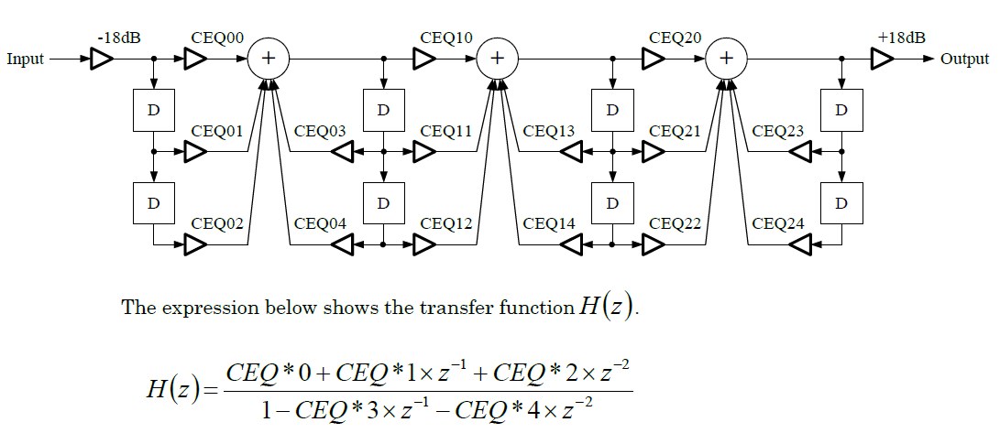

## System Setting

### CLKE

|I_ADR|W/R|D7|D6|D5|D4|D3|D2|D1|D0|Reset Value|
|-|-|-|-|-|-|-|-|-|-|-|
|#0|W/R|"0"|"0"|"0"|"0"|"0"|"0"|"0"|CLKE|00H|

#### Description
The CLKE is the register bit for controlling the internal master clock gating
(ENABLE/DISABLE).  
To activate the clock, set the CLKE to "1" with the ALRST set to "1".  
See "Initialization Procedure" for details of controlling the clock.
+ "0": Clock disabled (reset value)
+ "1": Clock enabled

#### Reset Conditions
1. When the power supplies are turned on (power-on reset).
2. When the hardware reset is applied (RST_N= "L").

### ALRST

| I_ADR | W/R | D7 | D6 | D5 | D4 | D3 | D2 | D1 | D0 | Reset Value |
|-|-|-|-|-|-|-|-|-|-|-|
|#1|W/R|ALRST|"0"|"0"|"0"|"0"|"0"|"0"|"0"|80H|

#### Description
The ALRST is the register used to reset all the interface register.  
+ "0": Out of the reset state.
+ "1": Resets the interface registers. (reset value)

The following interface registers are reset:  
+ I_ADR#3, #5 to #28, and from #32 to #79

The following interface registers including the control registers are not reset with this register
bit:
+ I_ADR#0: CLKE
+ I_ADR#1: ALRST (this register bit)
+ I_ADR#2: AP0-3
+ I_ADR#29: DRV_SEL
+ I_ADR#80: COMM

#### Reset Conditions
1. When the power supplies are turned on (power-on reset).
2. When the hardware reset is applied (RST_N= "L").

### AP0, AP1, AP2, AP3

| I_ADR | W/R | D7 | D6 | D5 | D4 | D3 | D2 | D1 | D0 | Reset Value |
|-|-|-|-|-|-|-|-|-|-|-|
|#2|W/R|"0"|"0"|"0"|"0"|AP3|AP2|AP1|AP0|0FH|

#### Description
The AP0-3 is the power-down control register bits in the analog block.  
When setting a register bit to "1" (reset value), its power-down state is established, resulting in lower power consumption. The correspondence between each register bit and its controllable

blocks is as follows:
+ AP0: VREF, IREF
+ AP1: SPAMP, SPOUT1
+ AP2: SPAMP, SPOUT2
+ AP3: DAC

#### Reset Conditions
1. When the power supplies are turned on (power-on reset).
2. When the hardware reset is applied (RST_N= "L").

### GAIN

| I_ADR | W/R | D7 | D6 | D5 | D4 | D3 | D2 | D1 | D0 | Reset Value |
|-|-|-|-|-|-|-|-|-|-|-|
|#3|W/R|"0"|"0"|"0"|"0"|"0"|"0"|GAIN1|GAIN0|01H|

#### Description

The GAIN is the register used for selecting a speaker amplifier gain as shown below:  

|GAIN1|GAIN0|SPAmplifier|Gain|
|-|-|-|-|
|"0"|"0"|SPOUT|gain =5.0dB|
|"0"|"1"|SPOUT|gain =6.5dB (reset value)|
|"1"|"0"|SPOUT|gain =7.0dB|
|"1"|"1"|SPOUT|gain =7.5dB|

Note) Gain values above assume no-load conditions.  
With 8ohm loaded, the gains become lower by about 0.2 dB (typ.).

#### Reset Conditions

1. When the power supplies are turned on (power-on reset).
2. When the hardware reset is applied (RST_N= "L").
3. When the ALRST is set to "1".

### HW_ID

| I_ADR | W/R | D7 | D6 | D5 | D4 | D3 | D2 | D1 | D0 | Reset Value |
|-|-|-|-|-|-|-|-|-|-|-|
|#4|R|"0"|"0"|"0"|"0"|"0"|"0"|"0"|"1"|01H|

#### Description
The HW_ID is the register used to hold the hardware version and read-only.  
The value is "01H" (fixed).  
The value can be read even if the ALRST bit is set to "1".

### CONTENTS_DATA_REG

| I_ADR | W/R | D7 | D6 | D5 | D4 | D3 | D2 | D1 | D0 | Reset Value |
|-|-|-|-|-|-|-|-|-|-|-|
|#7|W|DT7|DT6|DT5|DT4|DT3|DT2|DT1|DT0|-|

#### Description
The register is used to write contents data.

### Sequencer Setting

| I_ADR | W/R | D7 | D6 | D5 | D4 | D3 | D2 | D1 | D0 | Reset Value |
|-|-|-|-|-|-|-|-|-|-|-|
|#8|W/R|AllKeyOff|AllMute|AllEGRst|R_FIFOR|REP_SQ|R_SEQ| R_FIFO|START|00H|

### AllKeyOff
#### Description
The AllKeyOff is the register bit used to set the KeyOn registers of all the voices to "0".  

+ "0": no processing (reset value)
+ "1": Sets the KeyOn registers to "0".

After setting the register bit to "1", wait for more than 6us and then return it to "0".

#### Reset Conditions
1. When the power supplies are turned on (power-on reset).
2. When the hardware reset is applied (RST_N= "L").
3. When the ALRST is set to "1".

### AllMute
#### Description
The AllMute is the register bit used to set the Mute registers of all the voices to "1".  
+ "0": no processing (reset value)
+ "1": Sets the Mute registers to "1".

After setting the register bit to "1", wait for more than 6us and then return it to "0".

#### Reset Conditions
1. When the power supplies are turned on (power-on reset).
2. When the hardware reset is applied (RST_N= "L").
3. When the ALRST is set to "1".

### AllEGRst
#### Description
The AllEGRst is used to set the EG_RST registers of all the voices to "1".
+ "0": no processing (reset value)
+ "1": Sets the EG_RST registers to "1".

After setting the register bit to "1", wait for more than 6us and then return it to "0".

#### Reset Conditions
1. When the power supplies are turned on (power-on reset).
2. When the hardware reset is applied (RST_N= "L").
3. When the ALRST is set to "1".

### SEQ_Vol

| I_ADR | W/R | D7 | D6 | D5 | D4 | D3 | D2 | D1 | D0 | Reset Value |
|-|-|-|-|-|-|-|-|-|-|-|
|#9|W/R|SEQ_Vol4|SEQ_Vol3|SEQ_Vol2|SEQ_Vol1|SEQ_Vol0|DIR_SV|"0"|SIZE8|00H|
|#10|W/R|SIZE7|SIZE6|SIZE5|SIZE4|SIZE3|SIZE2|SIZE1|SIZE0|00H|

#### Description
The SEQ_Vol is the volume setting register of the sequencer volume.  

#### Reset Conditions
1. When the power supplies are turned on (power-on reset).
2. When the hardware reset is applied (RST_N= "L").
3. When the ALRST is set to "1".

|Value(HEX)|Volume[dB]|
|-|-|
|00H|mute|
|01H|-47.9|
|02H|-42.6|
|03H|-37.2|
|04H|-33.1|
|05H|-29.8|
|06H|-27.0|
|07H|-24.6|
|08H|-22.4|
|09H|-20.6|
|0AH|-18.9|
|0BH|-17.3|
|0CH|-15.9|
|0DH|-14.6|
|0EH|-13.4|
|0FH|-12.2|
|10H|-11.1|
|11H|-10.1|
|12H|-9.2|
|13H|-8.3|
|14H|-7.4|
|15H|-6.6|
|16H|-5.8|
|17H|-5.1|
|18H|-4.4|
|19H|-3.6|
|1AH|-3.0|
|1BH|-2.3|
|1CH|-1.7|
|1DH|-1.1|
|1EH|-0.6|
|1FH|0.0|

### DIR_SV

#### Description

The DIR_SV register bit controls whether to apply the interpolation to the SEQ_Vol and the ChVol0-15.  
When the register bit is set to "1", the interpolation is not applied to the SEQ_Vol and the ChVol0-15 regardless of the settings of the DIR_CV0?15 and the CHVOL_ITIME.  
When it is set to "0" (reset value), the interpolation is dependent on the DIR_CV0?15 and CHVOL_ITIME settings.

#### Reset Conditions
1. When the power supplies are turned on (power-on reset).
2. When the hardware reset is applied (RST_N= "L").
3. When the ALRST is set to "1".

### SIZE

#### Description
The SIZE is the register used to set the size of sequence data in bytes.

## Synthesizer Setting

### CRGD_VNO

| I_ADR | W/R | D7 | D6 | D5 | D4 | D3 | D2 | D1 | D0 | Reset Value |
|-|-|-|-|-|-|-|-|-|-|-|
|#11|W/R|"0"|"0"|"0"|"0"|CRGD_VNO3|CRGD_VNO2|CRGD_VNO1|CRGD_VNO0|00H|

#### Description
The CRGD_VNO is used to specify a voice number.

#### Reset Conditions
1. When the power supplies are turned on (power-on reset).
2. When the hardware reset is applied (RST_N="L").
3. When the ALRST is set to "1".

## Control Register Write Registers

| I_ADR | W/R | D7 | D6 | D5 | D4 | D3 | D2 | D1 | D0 |
|-|-|-|-|-|-|-|-|-|-|
|#12|W|"0"|VoVol4|VoVol3|VoVol2|VoVol1|VoVol0|"0"|"0"|
|#13|W|"0"|"0"|FNUM9|FNUM8|FNUM7|BLOCK2|BLOCK1|BLOCK0|
|#14|W|"0"|FNUM6|FNUM5|FNUM4|FNUM3|FNUM2|FNUM1|FNUM0|
|#15|W|"0"|KeyOn|Mute|EG_RST|ToneNum3|ToneNum2|ToneNum1|ToneNum0|
|#16|W|"0"|ChVol4|ChVol3|ChVol2|ChVol1|ChVol0|"0"|DIR_CV|
|#17|W|"0"|"0"|"0"|"0"|"0"|XVB2|XVB1|XVB0|
|#18|W|"0"|"0"|"0"|INT1|INT0|FRAC8|FRAC7|FRAC6|
|#19|W|"0"|FRAC5|FRAC4|FRAC3|FRAC2|FRAC1|FRAC0|"0"|
|#20|W|"0"|"0"|"0"|"0"|"0"|"0"|"0"|DIR_MT|

### VoVol

#### Description
The VoVol is the volume setting registers for each voice number.  
The relationship between setting values and volume gain values is the same as that of ChVol and SEQ_Vol.
The interpolation function is not provided for these volume setting registers.

#### Reset Value
+ 00H (Mute)

### FNUM, BLOCK

#### Description
+ BLOCK: Specifies an octave.
+ FNUM: Sets the frequency information for one octave.

They are set for each voice.

#### Reset Value
+ FNUM : 000H
+ BLOCK: 00H

#### Pitch Table

|Note|Frequency|BLOCK|FNUM|
|-|-|-|-|
|C2		|130.8	|3	|357|
|C#2	|138.6	|3	|378|
|D2		|146.8	|3	|401|
|D#2	|155.6	|3	|425|
|E2		|164.8	|3	|450|
|F2		|174.6	|3	|477|
|F#2	|185	|3	|505|
|G2		|196	|3	|535|
|G#2	|207.7	|3	|567|
|A2		|220	|3	|601|
|A#2	|233.1	|3	|637|
|B2		|246.9	|3	|674|
|C3		|261.6	|4	|357|
|C#3	|277.2	|4	|378|
|D3		|293.7	|4	|401|
|D#3	|311.1	|4	|425|
|E3		|329.6	|4	|450|
|F3		|349.2	|4	|477|
|F#3	|370	|4	|505|
|G3		|392	|4	|535|
|G#3	|415.3	|4	|567|
|A3		|440	|4	|601|
|A#3	|466.2	|4	|637|
|B3		|493.9	|4	|674|
|C4		|523.3	|5	|357|

### ToneNum

#### Description
The ToneNum is used to select a tone parameter to use.  
This register is provided for each voice.  

#### Reset Value
+ 00H

### KeyOn

#### Description
The KeyOn is used to control the sound generation.  
+ "0": KeyOff (reset value)
+ "1": KeyOn

This register is provided for each voice.

### Mute

#### Description
The Mute is the mute control register.  
This register is provided for each voice.   
+ "0: Cancels the mute (reset value)
+ "1": Shifts to the mute state.

The volume of a voice with the Mute set to "1" shifts to a mute state according to the DIR_MT(I_ADR#20) and the MUTE_ITIME(I_ADR#27) settings; however, when the mute is cancelled, the interpolation is not performed regardless of these settings.

### EG_RST

#### Description
A voice with the EG_RST set to "1" shifts to a mute state immediately regardless of the DIR_MT and MUTE_ITIME settings.  
This register is provided for each voice.   
Reset Value is "0".

### ChVol

#### Description
This volume setting register is provided for each voice.  
The interpolation function is provided for this volume setting register.  
The relationship between setting values and volume gain values is the same as that of VoVol and SEQ_Vol.
Reset Value is "18H" (-4.4 dB)

### DIR_CV

#### Description
The DIR_CV controls the interpolation of the SEQ_Vol and ChVol.  
This register is provided for each voice.   

DIR_CV="1":  
No interpolation in the SEQ_Vol and the ChVol# regardless of the DIR_SV and CHVOL_ITIME settings.

DIR_CV# = "0" (reset value):  
The interpolation depends on the DIR_SV and CHVOL_ITIME settings.

### XVB

#### Description
The XVB is used to set a vibrato modulation.  
This register is provided for each voice.   
A setting value relatively acts on a DVB setting value of the voice parameter, as shown below.  
When the calculation (add) result exceeds "3", "3"is used for the processing.

+ "0": OFF (reset value)
+ "1": 1 x (DVB value is used as is.)
+ "2": 2 x (DVB += 1)
+ "3": 2 x (DVB += 1)
+ "4": 4 x (DVB += 2)
+ "5": 4 x (DVB += 2)
+ "6": 8 x (DVB += 3)
+ "7": 8 x (DVB += 3)

### INT, FRAC

#### Description
These registers specify a multiplier to the generated audio frequency. This number and frequency are proportional.  
The INT is an integer part and FRAC is a fraction part.  
These registers are provided for each voice.  

#### Reset Value
+ INT : "01H"
+ FRAC: "000H"

### DIR_MT

The DIR_MT is used to control the interpolation in a mute state. This register bit works for all the 16 voices.
+ "0": Enables the interpolation. (reset value)
+ "1": Disables the interpolation.

When this register bit is set to "0", the MUTE_ITIME (I_ADR#27) setting becomes valid; however, the interpolation is not performed when the mute is cancelled regardless of this register and MUTE_ITIME setting.

## Volume Settings

### MASTER_VOL

| I_ADR | W/R | D7 | D6 | D5 | D4 | D3 | D2 | D1 | D0 | Reset Value |
|-|-|-|-|-|-|-|-|-|-|-|
|#25|W/R|MASTER_VOL5|MASTER_VOL4|MASTER_VOL3|MASTER_VOL2|MASTER_VOL1|MASTER_VOL0|"0"|"0"|00H|

#### Description
The MASTER_VOL is used to control the master volume level.  
The interpolation function is available.  

|DEC|HEX|Volume Level[dB]|
|-|-|-|
|0  |00H |muted  |
|1  |01H |-50  |
|2  |02H |-49  |
|3  |03H |-48  |
|4  |04H |-47  |
|5  |05H |-46  |
|6  |06H |-45  |
|7  |07H |-44  |
|8  |08H |-43  |
|9  |09H |-42  |
|10 |0AH |-41  |
|11 |0BH |-40  |
|12 |0CH |-39  |
|13 |0DH |-38  |
|14 |0EH |-37  |
|15 |0FH |-36  |
|16 |10H |-35  |
|17 |11H |-34  |
|18 |12H |-33  |
|19 |13H |-32  |
|20 |14H |-31  |
|21 |15H |-30  |
|22 |16H |-29  |
|23 |17H |-28  |
|24 |18H |-27  |
|25 |19H |-26  |
|26 |1AH |-25  |
|27 |1BH |-24  |
|28 |1CH |-23  |
|29 |1DH |-22  |
|30 |1EH |-21  |
|31 |1FH |-20  |
|32 |20H |-19  |
|33 |21H |-18|
|34 |22H |-17|
|35 |23H |-16|
|36 |24H |-15|
|37 |25H |-14|
|38 |26H |-13|
|39 |27H |-12|
|40 |28H |-11|
|41 |29H |-10|
|42 |2AH |-9|
|43 |2BH |-8|
|44 |2CH |-7|
|45 |2DH |-6|
|46 |2EH |-5|
|47 |2FH |-4|
|48 |30H |-3|
|49 |31H |-2|
|40 |32H |-1|
|51 |33H |0|
|52 |34H |+1|
|53 |35H |+2|
|54 |36H |+3|
|55 |37H |+4|
|56 |38H |+5|
|57 |39H |+6|
|58 |3AH |+7|
|59 |3BH |+8|
|60 |3CH |+9|
|61 |3DH |+10|
|62 |3EH |+11|
|63 |3FH |+12|

### MUTE_ITIME

| I_ADR | W/R | D7 | D6 | D5 | D4 | D3 | D2 | D1 | D0 | Reset Value |
|-|-|-|-|-|-|-|-|-|-|-|
|#27|W/R|"0"|DADJT|MUTE_ITIME1|MUTE_ITIME0|CHVOL_ITIME1|CHVOL_ITIME0|MVOL_ITIME1|MVOL_ITIME0|00H|

#### Description
The MUTE_ITIME is used to specify the volume level variation under the muted condition when the DIR_MT is "0".
+ "00b": No interpolation (reset value)
+ "01b": Setting prohibited
+ "10b": Enables the interpolation. (in 0.3750dB steps, 128/fs (0dB <-> Mute (approx. 2.7 ms))
+ "11b": Enables the interpolation. (in 0.1875dB steps, 256/fs (0dB <-> Mute (approx. 5.3 ms))

When the DIR_MT is "1", no interpolation is selected regardless of this register setting.

### CHVOL_ITIME

#### Description
The CHVOL_ITIME is used to specify the volume level variation time of the SEQ_Vol and the ChVol0-15.  
This variation time becomes valid only for voices with the DIR_SV set to "0"and the DIR_CV0-15 set to "1".
+ "00b": No interpolation (reset value)
+ "01b": Setting prohibited
+ "10b": Enables the interpolation. (approx. 0.2dB steps, 256/fs (0dB <-> Mute: approx. 5.3ms))
+ "11b": Enables the interpolation. (approx. 0.05 dB steps, 1024/fs (0dB <-> Mute: approx. 21.3ms))

### MVOL_ITIME

#### Description
The MVOL_ITIME is used to specify the master volume level variation time.
+ "00b": No interpolation (The setting value in the MASTER_VOL (I_ADR#25) is immediately reflected.) (reset value)
+ "01b": Enables the interpolation. (approx. 0.2 dB steps, 512/fs (+12dB <-> Mute: approx. 10.6ms))
+ "10b": Enables the interpolation. (approx. 0.1 dB steps, 1024/fs (+12dB <-> Mute: approx. 21.3 ms))
+ "11b": Enables the interpolation. (approx. 0.05 dB steps, 2048/fs (+12dB <-> Mute: approx. 42.6 ms))

### LFO_RST

| I_ADR | W/R | D7 | D6 | D5 | D4 | D3 | D2 | D1 | D0 | Reset Value |
|-|-|-|-|-|-|-|-|-|-|-|
|#28|W/R|"0"|"0"|"0"|"0"|"0"|"0"|"0"|LFO_RST|00H|

#### Description
The LFO_RST is used to reset the phase of the LFO (Low Frequency Oscillator).
+ "0": No processing (reset value)
* "1": Reset

Write "0" into the register bit after writing "1" to the bit.

### W_CEQ0/1/2

| I_ADR | W/R | D7-D0 | Reset Value |
|-|-|-|-|
|#32|W|W_CEQ0|-|
|#33|W|W_CEQ1|-|
|#34|W|W_CEQ2|-|

#### Description
The W_CEQ registers are used to set equalizer coefficients.  
There are 3 bytes x 5 coefficients (CEQ#0[23:0] to CEQ#4[23:0]) for each band and they correspond to the coefficient setting registers as follows:
+ W_CEQ0: Band 0 coefficients (CEQ00[23:0] to CEQ04[23:0])
+ W_CEQ1: Band 1 coefficients (CEQ10[23:0] to CEQ14[23:0])
+ W_CEQ2: Band 2 coefficients (CEQ20[23:0] to CEQ24[23:0])

The setting is independent one another. Write the coefficients to the registers in this order, as
shown below:

| No. | W_CEQ0 | W_CEQ1 | W_CEQ2 |
|-|-|-|-|
|1|CEQ00[23:16]|CEQ10[23:16]|CEQ20[23:16]|
|2|CEQ00[15:8]|CEQ10[15:8]|CEQ20[15:8]|
|3|CEQ00[7:0]|CEQ10[7:0]|CEQ20[7:0]|
|4|CEQ01[23:16]|CEQ11[23:16]|CEQ21[23:16]|
|5|CEQ01[15:8]|CEQ11[15:8]|CEQ21[15:8]|
|6|CEQ01[7:0]|CEQ11[7:0]|CEQ21[7:0]|
|7|CEQ02[23:16]|CEQ12[23:16]|CEQ22[23:16]|
|8|CEQ02[15:8]|CEQ12[15:8]|CEQ22[15:8]|
|9|CEQ02[7:0]|CEQ12[7:0]|CEQ22[7:0]|
|10|CEQ03[23:16]|CEQ13[23:16]|CEQ23[23:16]|
|11|CEQ03[15:8]|CEQ13[15:8]|CEQ23[15:8]|
|12|CEQ03[7:0]|CEQ13[7:0]|CEQ23[7:0]|
|13|CEQ04[23:16]|CEQ14[23:16]|CEQ24[23:16]|
|14|CEQ04[15:8]|CEQ14[15:8]|CEQ24[15:8]|
|15|CEQ04[7:0]|CEQ14[7:0]|CEQ24[7:0]|

The 15-byte coefficient values are reflected at the moment when the 15th coefficient (CEQ#4[7:0]) is written.  
Write 15 bytes of coefficients in burst mode for each band.  
If the write operation is stopped in the middle (less than 15 bytes), values are not reflected.  
And on the contrary, if the write operation continues even after the 15th bytes, the 15-byte  
coefficients are overwritten when all the next 15 coefficients are written.  

The coefficient data format is as follows:  
Sign bit: 1 bit (CEQ##[23]), integer part: 3 bits (CEQ##[22:20]) and fraction part: 20 bits
(CEQ##[19:0])
in 2'complement.  
The figure bellows shows the relationship between the coefficients and the circuit configuration.

